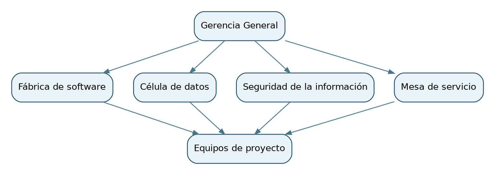

# 1.2 Estructura Organizacional

La estructura corporativa declarada por Only Simple Solutions reúne dirección general y cuatro capacidades operativas: fábrica de software, datos, seguridad de la información y mesa de servicio. Esta relación funcional explica quién proporciona recursos y supervisión a los contratos. El equipo de 16 profesionales previsto para Ancoa es una asignación de proyecto y se presenta por separado en 1.5; no se suma a la dotación corporativa de 85 personas.

**Figura 1. Esquema funcional de capacidades corporativas.** Muestra la relación entre dirección, capacidades compartidas y equipos de proyecto; no representa una nómina nominal ni líneas de reporte individual.

| Capacidad permanente | Función en la oferta | Dotación corporativa por área |
| :--- | :--- | :--- |
| Fábrica de software | Arquitectura, desarrollo e integración | Por conciliar con nómina institucional |
| Célula de datos | Gobierno, calidad, integración y migración | Por conciliar con nómina institucional |
| Seguridad de la información | Riesgos, controles y respuesta a incidentes | Por conciliar con nómina institucional |
| Mesa de servicio | Monitoreo, soporte y conocimiento operativo | Por conciliar con nómina institucional |

La distribución de los 85 profesionales entre estas capacidades aún requiere respaldo. La matriz de dedicación y el equipo nominado del contrato se desarrollan en el Capítulo 12 y en el Formulario T-8, conforme al índice obligatorio del Comunicado 10.
