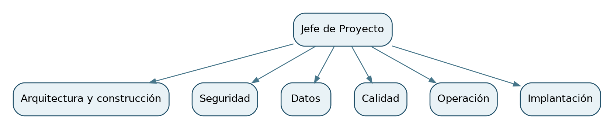

# 1.5 Estructura para Proyecto

Only Simple Solutions organizará el contrato de 56 meses bajo un Jefe de Proyecto y frentes de arquitectura y desarrollo, seguridad, datos, calidad, operación e implantación. El equipo funcional descrito en el borrador suma 16 profesionales. Su asignación y dedicación por período deberán conciliarse con el Capítulo 12, el Formulario T-8 y la nivelación de recursos; la cifra de 16 no equivale a presencia de jornada completa de todos los perfiles durante los 56 meses.

| Frente | Roles previstos | Personas | Aplicación al caso |
| :--- | :--- | ---: | :--- |
| Dirección | Jefe de Proyecto | 1 | Plazos, riesgos, cambios y relación contractual |
| Arquitectura y construcción | Arquitecto de Solución; ingenieros de solución y desarrollo | 3 | Arquitectura híbrida, levantamiento de nueve plataformas y catorce interfaces, integración y construcción |
| Seguridad | Encargado y analista de seguridad | 2 | Separación entre retail y crédito, accesos, riesgos y respuesta a incidentes |
| Datos | Líder e ingenieros de datos | 3 | Calidad, migración y conciliación de información, incluida la cartera de crédito |
| Calidad | Líder e ingenieros QA | 3 | Trazabilidad de requisitos, pruebas y evidencias de aceptación |
| Operación | Líder de Operación e ingeniero DevOps y soporte | 2 | Monitoreo, continuidad, recuperación y soporte |
| Implantación | Líder de Implantación y especialista de capacitación | 2 | Marchas blancas, despliegue en tiendas y capacitación por perfil y turno |
| **Total** | | **16** | |

**Figura 2. Frentes del proyecto.** Cada líder informa a la jefatura del contrato; Calidad mantiene independencia funcional para registrar desviaciones y objetar liberaciones.

La jefatura coordinará a la Contraparte Técnica de Ancoa mediante seguimiento semanal y un Comité de Proyecto quincenal. Los asuntos estratégicos y los cambios de alcance se elevarán al Comité Ejecutivo mensual. Las decisiones técnicas se revisarán en el Comité de Arquitectura mensual. Desde la preparación operativa se revisarán incidentes, niveles de servicio y transferencia; la operación contractual de 36 meses corresponde a los meses 21 a 56.

La cobertura específica de arquitectura de nube, integración, administración de bases de datos, mesa de servicio y soporte en terreno debe asignarse por nombre o función dentro de los frentes y reflejarse en la matriz de dedicación por meses. Las fichas curriculares, certificaciones individuales y cartas de compromiso del equipo nominado pertenecen al Capítulo 12 y al T-8. Su acreditación queda pendiente del anexo del equipo.
