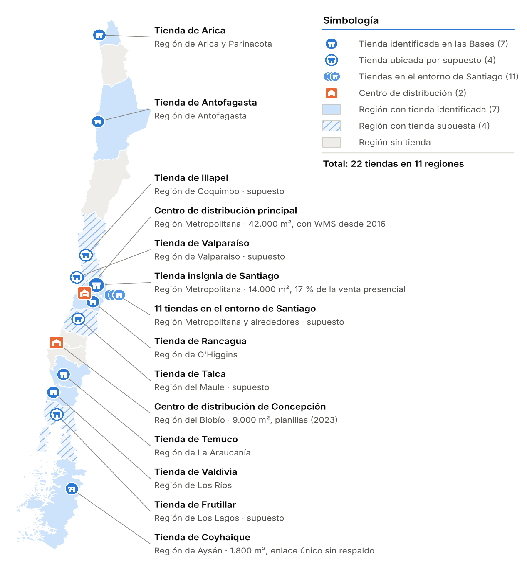

# 2.3 Dimensionamiento del problema

<!-- contenido migrado desde la fuente; permanece en borrador y requiere revisión humana -->

<!-- origen: Informes(5).md | bloque 8 -->

La siguiente sección establece qué tan grande es el problema descrito y por qué resulta crítico para la compañía. Para ello, se analizan las cuatro promesas que Ancoa realiza diariamente a sus clientes, estas son, que el producto existe, que el precio cobrado es el de la etiqueta, que la entrega llega en la fecha ofrecida y que las condiciones del crédito son las informadas. Cada una de estas promesas se dimensiona con los indicadores que se entregan, correspondientes a los datos obtenidos del año 2025 y al primer semestre de 2026, proveniente de los registros de la propia compañía.

Multitiendas Ancoa S.A registró ingresos consolidados de \$474.000 millones de pesos, a

Tabla 2.2:** Indicadores por promesa: valor actual, referencia y brecha.

<!-- tabla conservada: compara múltiples dimensiones -->

| Promesa que busca cumplir ancoa | Indicador | Valor actual | Criterio de aceptación de Ancoa | Diferencia entre el valor actual y el criterio de aceptación |
| :--- | :--- | :--- | :--- | :--- |
| **1\. El producto existe** | Diferencias detectadas en conteo cíclico | 12,4 % | \< 2 % | 6,2 veces |
|  | Merma o pérdida desconocida sobre la venta | 1,9 % | \< 1 % | 1,9 veces |
|  | Pedidos en línea cancelados por falta de existencia, 2025 | 1,9 % | \< 0,3 % | 6,3 veces |
|  | Pedidos cancelados en el evento de junio de 2026 | 2,7 % | 0 | Sin tolerancia |
| **2\. El precio es el exhibido** | Productos con precio exhibido distinto del cobrado (muestra de 120\) | 11 % | Sin valor numérico | No calculable |
| **3\. La entrega llega en la fecha** | Pedidos entregados en la fecha ofrecida | 81 % | \> 97 % | 6,3 veces (19 % frente a 3 % fuera de plazo) |
| **4.Las condiciones del crédito son las informadas** | Tiempo de evaluación crediticia en el punto de venta | 40 s a 3 min | \< 10 s | 4 a 18 veces |
|  | Repactaciones sin evidencia recuperable del consentimiento | 1.240 | 0 | Sin tolerancia |
|  | Conservación de las grabaciones de originación y repactación | 90 días | Plazo del crédito \+ 6 años | 24,3 veces o más |

Como muestra la tabla, ninguna de las cuatro promesas alcanza la referencia definida y en tres de ellas, la compañía tampoco cuenta con un registro que le permita demostrar lo ocurrido.

<!-- origen: Informes(5).md | bloque 9 -->

### Promesa 1: El producto existe

En cuanto a las

<!-- origen: Informes(5).md | bloque 10 -->

### Promesa 2: El precio es el exhibido

En cuanto a las

<!-- origen: Informes(5).md | bloque 11 -->

### Promesa 3: La entrega llega en la fecha

En cuanto a las

<!-- origen: Informes(5).md | bloque 12 -->

### Promesa 4: Las condiciones del crédito son las informadas** HOLA SAMIRA DONDE ESTASHOLA SAMIRA DONDE ESTAS

En cuanto a las

<!-- origen: Informes(5).md | bloque 13 -->

### Síntesis …………

En cuanto a las
