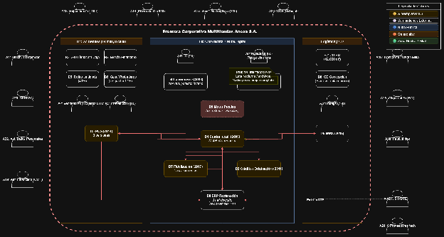

# 3.3 Esquema de solución

<!-- contenido migrado desde la fuente; permanece en borrador y requiere revisión humana -->

<!-- origen: T7-03_Informes4_source.md | bloque 23 -->

## Diagrama conceptual de solución e interacción de actores

Figura 3.1: Diagrama conceptual de solución e interacción de actores.
