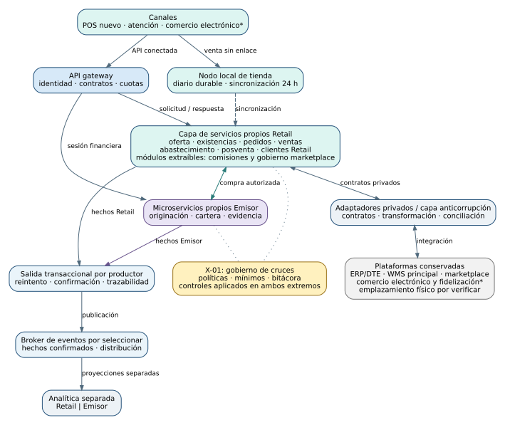
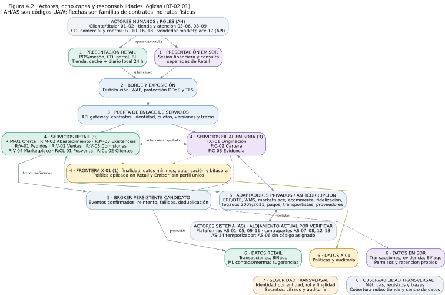
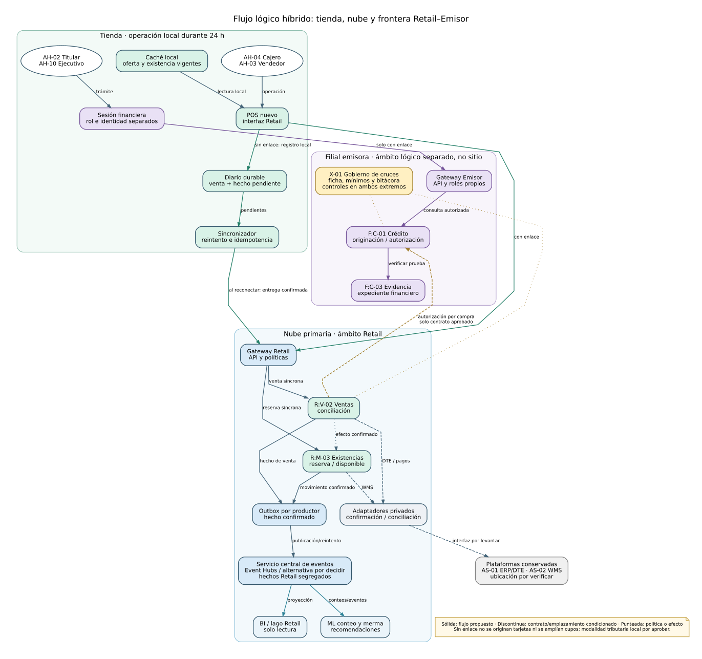
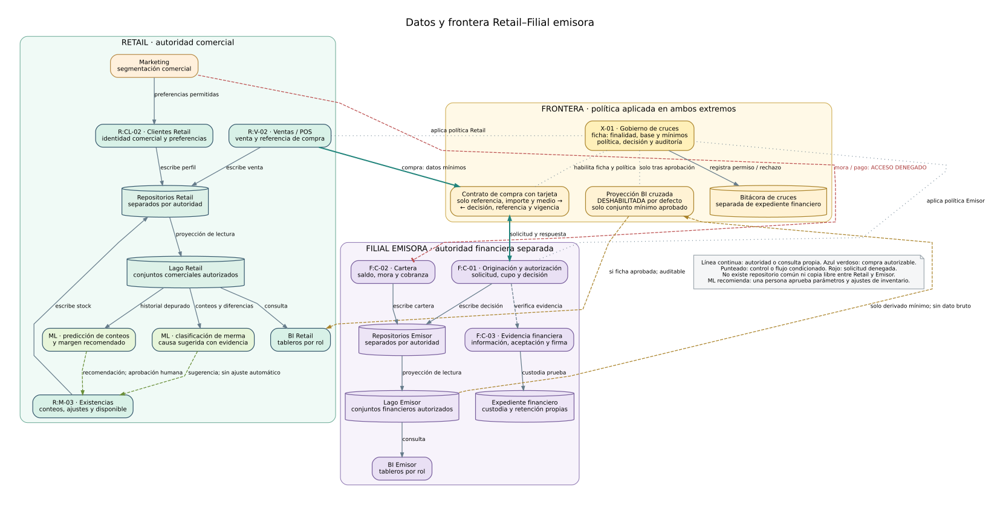
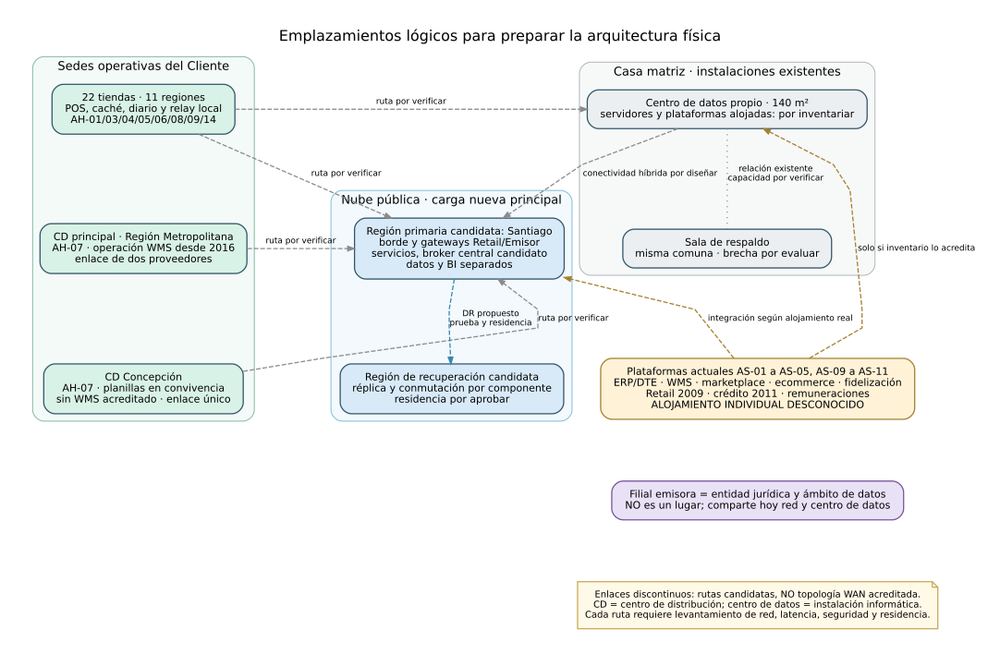

# Subdocumento 4 explicado: arquitectura lógica y física

**Informe para exposición y revisión · 8 de octubre de 2026**
**Proyecto:** Multitiendas Ancoa S.A., licitación TFEP-01/2026
**Documento explicado:** [SD-04, versión LaTeX actual](../../02_Propuesta/latex_final/sd-04.tex) · [PDF de revisión](vistas_previas/T7-04_latex_preview.pdf)

> **Cómo leer las láminas.** «Exigido» significa que proviene de las Bases. «Diseño» identifica una respuesta del equipo al problema. «Candidato» es una tecnología propuesta para evaluar. «Pendiente» señala una decisión que necesita inventario, ensayo o aprobación. Las flechas de los diagramas describen relaciones lógicas; no certifican rutas de red existentes.

---

## Lámina 1 · Qué problema resuelve este documento

Ancoa vende productos en 22 tiendas y canales digitales, y una filial distinta emite crédito. Sus plataformas intercambian información por catorce interfaces existentes. Si el precio, la existencia, el pedido o el crédito muestran estados distintos, la compañía puede prometer algo que después no logra cumplir o acreditar.

**SD-03 define qué solución se ofrece; SD-04 explica cómo se organiza y dónde operaría.** Su propósito es permitir que una persona siga una operación desde el actor que la inicia hasta el sistema responsable, sus datos y el lugar donde se ejecuta. El documento llega a una **arquitectura física preliminar**, todavía sin inventario de equipos, enlaces y ubicaciones individuales de todos los sistemas.

**Palabras clave:** POS es la caja o punto de venta; ERP/DTE es la plataforma empresarial que emite documentos tributarios; WMS gestiona la operación del almacén; API es una interfaz para que dos sistemas se comuniquen; *gateway* controla la entrada a esas interfaces; *broker* distribuye mensajes entre componentes; *lago de datos* guarda información preparada para análisis. «Autoridad del dato» significa el componente que puede confirmar su escritura oficial.

**Fundamento:** Caso 09, [alcance de SD-03](../../02_Propuesta/latex_final/sd-03.tex) y SD-04 §4.

---

## Lámina 2 · La propuesta en una imagen

1. Una persona o un sistema entra por un canal: caja, comercio electrónico, atención, consola interna o API.
2. El **API gateway** controla las solicitudes autorizadas: identidad, contrato, cuota y trazabilidad.
3. Los servicios nuevos se reparten entre **Retail**, **Filial emisora** y **Frontera de datos**.
4. Los **adaptadores** traducen contratos de plataformas que continúan operando. Un **broker** distribuye hechos ya confirmados.
5. La tienda conserva un nodo local para vender durante un corte del enlace. Retail y Emisor mantienen datos separados.

**Por qué:** así se puede cambiar una parte sin sustituir automáticamente ERP/DTE, WMS o marketplace, y se preserva la separación entre comercio y crédito. **Estado:** diseño lógico; el producto del broker y las rutas físicas siguen abiertos. [Fuente editable](../../04_Adjuntos/diagramas/borradores/diag-04-01_arquitectura-logica.dot).

---

## Lámina 3 · A quién debe servir la arquitectura

El catálogo UAW aportado registra **31 actores**: 18 personas o roles (`AH-01` a `AH-18`) y 13 sistemas o disparadores (`AS-01` a `AS-14`, sin `AS-06`). La [matriz completa actor → entrada → servicio](especificacion_diagramas_sd04.md#correspondencia-de-todos-los-actores-uaw) permite revisar uno por uno. La tabla 4.1 de SD-04 los agrupa para que el documento principal sea legible.

| Ejemplo de actor | Entrada visible | Quién responde |
| :--- | :--- | :--- |
| Cliente y cajero | Comercio electrónico o POS | Oferta, existencias, pedidos y ventas Retail. |
| Personal de tienda y de ambos centros de distribución | Terminal de conteo, reposición o logística | Abastecimiento y existencias; el WMS ejecuta las tareas del almacén principal. |
| Titular y ejecutivo financiero | Acceso financiero o sesión de caja con rol separado | Originación, cartera y evidencia del Emisor. |
| Vendedor externo | API autorizada | Gobierno marketplace, conectado con la plataforma existente. |
| Analista BI | Autoservicio según rol | Datos Retail **o** Emisor; un cruce requiere autorización propia. |

**Por qué:** «actor» identifica quién usa o activa una función, no un servidor nuevo. Por ejemplo, remuneraciones (`AS-11`) es un módulo del ERP (`AS-01`), y el temporizador (`AS-14`) solo inicia tareas programadas. **Fundamento:** [catálogo UAW suministrado](../../80_Artefactos/sd-04_contexto/02_actores_uaw.md) y SD-04 §4.1.

---

## Lámina 4 · Cinco maneras de mirar la misma solución

| Vista exigida por RT-02.03 | Pregunta que responde | Dónde verla |
| :--- | :--- | :--- |
| Lógica | ¿Qué responsabilidad tiene cada componente? | Figuras 4.1 y 4.2; tablas 4.1 a 4.4. |
| Procesos | ¿Qué ocurre durante venta, pedido, crédito y caída del enlace? | Figura 4.3 y recorridos de §4.1. |
| Despliegue | ¿En qué sitio se propone ejecutar cada componente? | Figura 4.4; tablas 4.7 y 4.8. |
| Datos | ¿Quién puede escribir cada registro y quién consulta una copia? | Tabla 4.2 y figura 4.5. |
| Seguridad | ¿Cómo se autorizan y auditan los accesos y cruces? | Figura 4.5 y apartado de seguridad. |

**Por qué cinco vistas:** una sola imagen no permite explicar simultáneamente funciones, recorrido, ubicación, propiedad de datos y permisos. La separación responde directamente a [RT-02.03](../../00_Bases/Bases_Transversales.md). Cada vista usa los mismos códigos para evitar que un servicio cambie de nombre según la figura.

---

## Lámina 5 · Las ocho capas, de arriba hacia abajo

| Capa | Explicación sencilla | Razón de incluirla |
| :--- | :--- | :--- |
| 1. Presentación | Pantallas, POS y portales que usan personas. | Dar una entrada adecuada a cada actor. |
| 2. Borde | Exposición y protección del tráfico externo. | Reducir la superficie expuesta. |
| 3. Puerta de enlace | Entrada gobernada para las API. | Aplicar identidad, contratos, cuotas y trazabilidad. |
| 4. Servicios | Reglas de negocio Retail, Emisor y Frontera. | Asignar responsable a cada operación. |
| 5. Integración | Contratos, adaptadores, publicación y broker de eventos. | Conectar servicios nuevos y plataformas conservadas. |
| 6. Datos | Registros transaccionales, documentos y analítica separados. | Saber quién puede escribir y consultar cada dato. |
| 7. Seguridad | Permisos, cifrado y auditoría. | Proteger accesos en todas las capas. |
| 8. Observabilidad | Métricas, registros y seguimiento de operaciones. | Detectar fallas y reconstruir lo ocurrido. |

**Fundamento:** [RT-02.01](../../00_Bases/Bases_Transversales.md) exige las ocho responsabilidades. Seguridad y observabilidad atraviesan las demás capas; no son pasos adicionales que cada venta deba recorrer. [Fuente editable](../../04_Adjuntos/diagramas/borradores/diag-04-02_capas-y-actores.dot).

---

## Lámina 6 · Trece servicios de negocio; no trece aplicaciones obligatorias

| Ámbito | Servicios | Qué conserva como autoridad |
| :--- | :--- | :--- |
| Mercadería Retail | `R:M-01` oferta; `R:M-02` abastecimiento; `R:M-03` existencias. | Precio y promoción; órdenes y reposición; movimientos, conteos, reservas y disponibilidad. |
| Venta Retail | `R:V-01` pedidos; `R:V-02` ventas; `R:V-03` comisiones; `R:V-04` marketplace. | Promesa y estado del pedido; venta y conciliación; base de comisión; reglas de vendedores. |
| Relación Retail | `R:CL-01` posventa; `R:CL-02` clientes Retail. | Caso y destino de devolución; identidad y preferencias comerciales. |
| Filial emisora | `F:C-01` originación; `F:C-02` cartera; `F:C-03` evidencia. | Decisión de crédito; cuenta, pagos y mora; documentos, aceptación y firma. |
| Frontera | `X-01` control de cruces. | Fichas, políticas, decisiones y bitácora; no guarda un perfil unificado. |

**Por qué la división:** cada registro necesita un responsable único. Existencias decide qué se puede prometer; ERP/DTE conserva contabilidad y emisión tributaria; WMS conserva la ejecución física del almacén. Una responsabilidad de negocio puede convertirse en microservicio, módulo o parte de un despliegue compartido según autoridad, carga y operación. Comisiones y gobierno marketplace son **módulos extraíbles**; no se despliegan por separado solo para aumentar el número de microservicios. **Fundamento:** SD-03 §§3.3–3.4 y SD-04 tablas 4.2–4.3.

---

## Lámina 7 · Qué plataformas cambian y cuáles permanecen

| Tratamiento | Plataformas | Justificación |
| :--- | :--- | :--- |
| Conservar e integrar | ERP/DTE, WMS principal y marketplace 2022. | Sus funciones siguen dentro del alcance operativo y ya tienen una plataforma; reemplazarlas añadiría una migración que SD-03 no propone. |
| Integrar y evaluar | Comercio electrónico 2019 y fidelización 2017. | Deben funcionar durante la convivencia; conservación, corrección o sustitución se decidirá con pruebas de la primera etapa. Fidelización conserva puntos y campañas mientras tanto. |
| Reemplazar por olas | Núcleo Retail 2009, crédito 2011 y POS 2014. | Son las piezas cuyo retiro o sustitución acompaña el nuevo registro de autoridad, la migración de cartera y la continuidad de tienda. |
| Crear capacidad | Motor de precios dentro de oferta comercial. | El caso lo necesita, pero no existe como novena plataforma vigente. |

**Por qué por olas:** cada tramo convive con el sistema anterior, compara resultados y permite corregir o volver atrás antes del retiro. El Caso menciona nueve plataformas, pero enumera ocho existentes y un motor inexistente; SD-04 no inventa una más. **Dato que falta:** el Caso no indica dónde está hospedada individualmente cada plataforma. **Fundamento:** SD-04 tabla 4.4 y [Caso 09](../../00_Bases/Caso_09_Cadena_Multitienda.md).

---

## Lámina 8 · Cómo se conecta una venta

**Con enlace:** el cajero consulta la versión vigente del precio y una reserva confirmada de existencias. Ventas registra la operación y el pago; ERP/DTE emite el documento tributario. Solo después se publica el hecho de venta para actualizar vistas y consumidores.

**Sin enlace:** el POS lee oferta y existencia locales y guarda venta y hecho pendiente en un **diario durable**. El broker de nube no puede recibir algo que la tienda aún no logró enviar. Al volver la conexión, un sincronizador entrega con identificador repetible; Ventas concilia, confirma y recién entonces publica el hecho. Las reglas fiscales y de cobro de esta modalidad requieren aprobación y prueba.

**Por qué:** la operación local responde a la continuidad híbrida exigida por [RT-03.10](../../00_Bases/Bases_Transversales.md). El requisito transversal pide **24 horas**; el Caso menciona 8 horas para tienda, pero no puede rebajar el mínimo transversal. El diario evita depender de una WAN disponible y la conciliación evita duplicar ventas al reintentar. El diseño prueba las 24 horas y el retorno. Un broker adicional en tienda solo se justificaría si varios consumidores locales debieran comunicarse sin nube. [Fuente editable](../../04_Adjuntos/diagramas/borradores/diag-04-03_flujo-hibrido.dot).

---

## Lámina 9 · Qué debe responder de inmediato y qué puede esperar

| Necesidad | Mecanismo | Ejemplo | Razón |
| :--- | :--- | :--- | :--- |
| Continuar o detener una operación ahora | Solicitud y respuesta con tiempo máximo e identificador. | Reservar stock antes de cobrar; decidir una compra con tarjeta. | Sin respuesta válida no se puede prometer ni autorizar. |
| Informar algo que ya ocurrió | Evento confirmado, persistido por el productor y distribuido por broker. | Venta registrada, devolución recibida, pedido que cambió de estado. | Varios consumidores pueden actualizarse y recuperarse de fallas. |
| Operar mientras falta red | Registro local y sincronización posterior. | Venta en tienda desconectada. | Ningún servicio en nube puede confirmar una operación que aún no conoce. |

Los eventos se pueden entregar más de una vez. Por eso cada consumidor reconoce el identificador, evita aplicar duplicados, reintenta y aparta errores persistentes. El orden se conserva donde el proceso lo exige. **Kafka es una preferencia, no una exigencia del pliego:** se comparan Kafka, Event Hubs y Service Bus con pruebas de relectura, errores, recuperación y operación híbrida. El gateway atiende solicitudes API; el broker reparte mensajes. **Fundamento:** SD-04 §4.1, ADR-03 y ADR-06.

---

## Lámina 10 · Cómo se protege la frontera Retail–Emisor

La tienda y la filial emisora pueden compartir edificios y red, pero **no comparten libremente clientes ni bases de datos**. Retail conserva la identidad y preferencias comerciales; el Emisor conserva cupo, saldo, pagos, mora y expediente crediticio. El servicio `X-01` define la finalidad, los campos mínimos, el fundamento y los responsables de cada cruce. Los dos extremos aplican esa política y registran la decisión.

**Ejemplo permitido, condicionado:** para pagar con la tarjeta propia, Ventas comunica referencia, importe y medio mediante un contrato aprobado; el Emisor devuelve una decisión limitada a esa compra. **Ejemplo denegado:** Marketing solicita mora o historial de pagos. La consulta se bloquea y audita. La autorización de compra no se infiere del silencio ni del consentimiento de originación.

**Por qué:** Ancoa reúne un comercio y un emisor fiscalizado con finalidades jurídicas distintas. La separación responde al Caso y a SD-03; las fichas concretas requieren revisión jurídica. [Fuente editable](../../04_Adjuntos/diagramas/borradores/diag-04-05_datos-y-frontera.dot).

---

## Lámina 11 · Datos para análisis y modelos predictivos

**BI y lagos de datos.** Los registros operativos generan copias de lectura con origen conocido. Retail y Emisor tienen lagos, permisos y tableros separados. Un analista entra por autoservicio según su rol; una vista mezclada permanece cerrada hasta aprobar una finalidad y los campos mínimos. Esta separación permite analizar sin ampliar automáticamente la frontera de datos.

**Dos modelos de apoyo para inventario:**

- **Conteo predictivo:** propone dónde contar primero según historial de diferencias y movimientos.
- **Clasificación de merma:** sugiere la causa probable de una diferencia para orientar su revisión.

Ningún modelo escribe ajustes de inventario ni cambia la disponibilidad prometida por sí solo. Una persona valida la recomendación y `R:M-03` registra el movimiento autorizado. **Por qué:** el caso necesita mejorar la precisión de existencias; una predicción incierta no puede sustituir el registro oficial. **Estado:** capacidades propuestas sujetas a calidad de datos, beneficio medido y supervisión; los productos analíticos específicos siguen por seleccionar. **Fundamento:** SD-04 §§4.1 y 4.1.1.

---

## Lámina 12 · Dónde ocurre cada cosa

| Código | Lugar o grupo | Papel en el diseño |
| :--- | :--- | :--- |
| `SIT-01` | 22 tiendas | POS, periféricos, diario local y sincronización. |
| `CD-01` / `CD-02` | Centros de distribución principal / Concepción | Operación logística; WMS acreditado en la operación del principal, sin presumir allí su servidor. |
| `DC-01` / `DC-02` | Centro de datos de casa matriz de 140 m² / sala de respaldo en la misma comuna | Instalaciones existentes; plataformas alojadas, capacidades y brechas por inventariar. |
| `CLD-01` / `CLD-02` | Nube primaria en Santiago / recuperación candidata en São Paulo | Cargas nuevas y recuperación condicionada a residencia y prueba. |
| `EXT-01` | Contrapartes fuera de la solución nueva | Transportistas, pagos, proveedores y otras plataformas según su ubicación comprobada. |

**Por qué distinguirlos:** un centro de *distribución* mueve productos; un centro de *datos* aloja tecnología. La filial es una entidad jurídica y un dominio de datos, no una nueva sede física. El diagrama no impone una cadena tienda → centro de distribución → centro de datos → nube. Cada enlace se confirmará con el inventario de red. [Fuente editable](../../04_Adjuntos/diagramas/borradores/diag-04-04_emplazamientos-logicos.dot).

---

## Lámina 13 · Por qué nube, tienda y centro de datos conviven

El [artículo 16 de las Bases Administrativas](../../00_Bases/Bases_Administrativas.md) exige un despliegue **híbrido**: carga principal en nube pública más componentes locales. La nube propuesta aloja servicios nuevos, gateway, integración y datos separados. Cada tienda conserva lo necesario para continuar durante un corte. El centro de datos del Cliente sigue atendiendo las dependencias que se compruebe que residen allí durante la transición.

La región primaria candidata es **Santiago**. Una región de **São Paulo** se estudia para recuperar cargas nuevas; cada réplica, especialmente financiera, necesita aprobar residencia de datos. La sala de respaldo de casa matriz está en la misma comuna que el recinto principal y se debe evaluar su riesgo compartido. Para los servicios críticos se comprobarán **RTO ≤ 4 horas** (tiempo para recuperar servicio) y **RPO ≤ 15 minutos** (máximo de datos perdidos), conforme a [RT-07.04](../../00_Bases/Bases_Transversales.md); la conmutación se ensayará dos veces al año.

**Estado:** emplazamiento propuesto. Disponibilidad regional por producto, enlaces redundantes, fallas comunes, capacidad y residencia deben verificarse antes de cerrar la arquitectura física. **Fundamento:** SD-04 §§4.2–4.3.

---

## Lámina 14 · Por qué Azure es referencia y Google sigue en evaluación

| Pregunta | Respuesta que refleja SD-04 |
| :--- | :--- |
| ¿Se adjudicó Azure? | **No.** Es la referencia de diseño, coherente con la alianza planteada en SD-01; la acreditación del socio exigida por las Bases sigue pendiente. |
| ¿Qué favorece a Azure en esta propuesta? | Un conjunto candidato coherente de infraestructura, API, datos, identidad, secretos, monitoreo y BI para comparar y especificar en T-11. Es una decisión de diseño inicial, no una prueba de que todos los productos estén disponibles en Chile Central. |
| ¿Por qué evaluar Google Cloud? | Su servicio administrado de Apache Kafka figura disponible en Santiago; también ofrece alternativas para cómputo, gateway, datos y analítica. |
| ¿Qué complica la elección? | En Azure Chile Central aún no se acreditó Kafka administrado; operarlo en AKS añade carga de operación. Event Hubs habla el protocolo Kafka, pero no es el mismo broker. Además deben comprobarse residencia, recuperación, conectividad híbrida, soporte y disponibilidad de cada producto/región. |

La decisión se cerrará con evidencia por producto y pruebas de los flujos críticos. El presupuesto del caso permite priorizar corrección, continuidad y seguridad; el costo se dimensiona para sostener la solución elegida. **Fundamento:** SD-04 §4.1.1 y §4.3, con las referencias de proveedores listadas al final de SD-04.

---

## Lámina 15 · Qué tecnologías aparecen y con qué grado de compromiso

| Capacidad | Candidato en SD-04 | Motivo y comprobación pendiente |
| :--- | :--- | :--- |
| Servicios transaccionales | Java 25 LTS, Spring Boot 4 y contenedores AKS. | Base inicial para API y procesos independientes; validar desempeño, personal, actualización y recuperación. |
| Vistas nuevas | TypeScript y React. | Cubren portales y vistas POS; el empaquetado local depende de periféricos y ensayo desconectado. |
| Entrada API | Azure API Management; Apigee como alternativa. | Identidad, cuotas, contratos y disponibilidad regional. |
| Eventos | Kafka preferido; Event Hubs y Service Bus comparables. | Elegir por semántica requerida, relectura, fallas y operación híbrida. |
| Datos de negocio | PostgreSQL administrado por contexto; caché Redis reconstruible. | Autoridad separada, alta disponibilidad y réplica; la caché no guarda el único registro. |
| Analítica | Azure Data Lake Storage Gen2 y Power BI; BigQuery/Looker en comparación. | BI segregado; permisos, linaje y disponibilidad regional antes de decidir. |
| Identidad y secretos | Federación con directorio del Cliente; Entra ID y Key Vault candidatos. | Confirmar el directorio actual y sus protocolos. |
| Observación y entrega | OpenTelemetry, Azure Monitor, Terraform y canal de despliegue auditado. | Cubrir nube, tiendas y centro de datos; comprobar herramientas existentes del Cliente. |
| Tienda | Nodo redundante con diario y sincronizador. | Motor, hardware, periféricos y modalidad fiscal se fijan tras inventario y piloto. |

**Lectura correcta:** esta tabla explica la *selección inicial* de la tabla 4.6. No equivale a una compra ni a una versión cerrada; cantidades, licencias y soporte pertenecerán al Formulario T-11.

---

## Lámina 16 · Las seis decisiones de arquitectura y su prueba

| Decisión | Razón | Cómo se defenderá |
| :--- | :--- | :--- |
| **ADR-01 · Migración por olas** | Retirar el núcleo Retail de 2009 sin un corte único de toda la operación. | Mapa de interfaces, conciliación y retorno por ola. |
| **ADR-02 · Datos separados** | Retail y Emisor tienen autoridades y finalidades diferentes. | Intentos permitidos y denegados, más bitácora de `X-01`. |
| **ADR-03 · Contratos mixtos** | Reserva y crédito requieren respuesta; los hechos confirmados pueden distribuirse después. | Latencia, duplicados, reintentos y pérdida de enlace. |
| **ADR-04 · POS local** | La tienda debe seguir vendiendo si pierde conectividad. | Piloto de 24 horas y reconciliación sin pérdida ni duplicidad. |
| **ADR-05 · Partición selectiva** | Ventas, existencias y crédito necesitan autoridad y recuperación propias; otras funciones pueden ser módulos. | Carga, fallas aisladas y esfuerzo operativo. |
| **ADR-06 · Broker y gateway** | Hay que distribuir hechos confirmados y gobernar las API. | Comparativa Kafka/Event Hubs/Service Bus, recuperación y contratos de adaptadores. |

**Fundamento:** SD-04 tabla 4.5. «ADR» significa registro de decisión arquitectónica: anota el motivo, las alternativas y la evidencia que permitirá ratificarla o cambiarla.

---

## Lámina 17 · Lo que el subdocumento 4 aún no puede afirmar

| Evidencia o acuerdo que falta | Decisión que desbloquea |
| :--- | :--- |
| Inventario de las catorce interfaces y alojamiento individual de plataformas. | Ubicar adaptadores, trazar enlaces reales y planear retiros. |
| Topología WAN, enlaces por tienda y CD, hardware y periféricos. | Dimensionar sitio, ruta, redundancia y contingencia. |
| Informe de brechas del centro de datos de 2024. | Definir papel real de DC-01 y DC-02 en convivencia y recuperación. |
| Medición de ventas, mensajes, concurrencia y crecimiento. | Fijar capacidad, particiones/colas, almacenamiento y niveles de servicio. |
| Revisión jurídica de cada cruce y residencia de datos del Emisor. | Habilitar contratos `X-01`, BI cruzado si procede y réplica secundaria. |
| Política de diferencia entre precio exhibido y caja, falta de stock, pago y DTE durante corte. | Cerrar comportamiento comercial y fiscal de tienda desconectada. |
| Pruebas regionales y operativas de nube y broker. | Elegir productos, versiones, licencias y especificación T-11. |

Estas tareas son parte de la preparación de la arquitectura física: cada conexión final deberá declarar **origen, destino, contrato, red, protección, volumen, latencia, responsable y comportamiento ante fallas**. No conviene presentar una flecha conceptual como si ya fuera un circuito instalado. **Fundamento:** SD-04 §§4.1–4.3 y [especificación de flujos](especificacion_diagramas_sd04.md).

---

## Lámina 18 · La explicación en un minuto

> Ancoa necesita que precio, existencias, pedidos y crédito coincidan sin mezclar el negocio comercial con el financiero. El diseño conserva ERP/DTE, WMS y marketplace, reemplaza por etapas el núcleo Retail, el crédito heredado y los POS, e integra inicialmente comercio electrónico y fidelización. Los servicios nuevos tienen responsables de datos definidos; un gateway controla las solicitudes y un broker por seleccionar distribuye los hechos confirmados. Cada tienda guarda ventas localmente si pierde red y las concilia al reconectar. Retail y la Filial emisora tienen datos y BI separados, con cruces mínimos gobernados por `X-01`. La nube aloja la carga nueva; la ubicación real de plataformas existentes y los enlaces se determinarán con inventario y pruebas. Azure es la referencia inicial, no una selección cerrada.

### Fuentes para ampliar o defender una pregunta

- [SD-04 completo](../../02_Propuesta/latex_final/sd-04.tex) y [PDF compilado](vistas_previas/T7-04_latex_preview.pdf): decisiones, tablas 4.1–4.8 y figuras 4.1–4.5.
- [SD-03](../../02_Propuesta/latex_final/sd-03.tex): alcance, escenario B y recorridos de negocio.
- [Bases Administrativas](../../00_Bases/Bases_Administrativas.md), [Bases Transversales](../../00_Bases/Bases_Transversales.md) y [Caso 09](../../00_Bases/Caso_09_Cadena_Multitienda.md): exigencias y hechos del caso.
- [Actores UAW](../../80_Artefactos/sd-04_contexto/02_actores_uaw.md), [matriz de nodos y veinte flujos](especificacion_diagramas_sd04.md) y [archivos editables de las figuras](../../04_Adjuntos/diagramas/).
