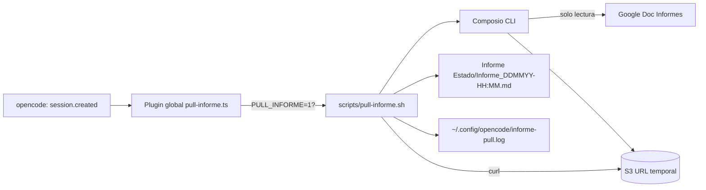

# Pull automático del Informe — Guía de configuración

> **Qué hace (en una frase):** cuando abres una sesión de opencode en **esta máquina**, descarga automáticamente (solo lectura) el Google Doc **"Informes"** (`1RRCVfA6HkCd9vfIrJZAbYhnL7IIVmWsaLEiV8QEHwl0`) como Markdown y lo guarda con marca de tiempo en `Informe Estado/` (ej. `Informe_0309-11:42.md`).

---

## 1. Cómo está montado (arquitectura)



**Flujo detallado:**
1. Al abrir una sesión, opencode dispara el evento `session.created`.
2. El plugin **global** `pull-informe.ts` lo recibe.
3. Solo si la variable de entorno `PULL_INFORME=1` está activa, lanza el script en segundo plano.
4. El script `pull-informe.sh` exporta el documento como Markdown vía Composio (`GOOGLEDRIVE_DOWNLOAD_FILE` con `mime_type: text/markdown`).
5. Descarga los bytes desde el S3 URL entregado por Composio.
6. Guarda la copia en `Informe Estado/Informe_<DDMM>-<HH:MM>.md`.
7. Registra el resultado en `~/.config/opencode/informe-pull.log`.

---

## 2. Por qué es “por dispositivo” y no en el repositorio

| Mecanismo | Ámbito | ¿Aparece al clonar el repo? | ¿Afecta a compañeros? |
| :--- | :--- | :--- | :--- |
| `.opencode/plugins/` (del repo) | Proyecto | **Sí** (se versiona) | ❌ Los afectaría |
| `~/.config/opencode/plugins/` (**global**) | **Esta máquina** | No | ✅ No los afecta |
| Variable `PULL_INFORME` en `~/.bashrc` | **Esta máquina** | No | ✅ No los afecta |
| Conexión Google Drive de Composio | Cuenta local | No | ✅ No los afecta |

El punto clave: **todo vive en `~/.config/opencode/`, que no es parte del repositorio.** Un compañero que clone `Licitación` no recibe ni el plugin, ni el script, ni la variable, ni la conexión de Drive. Por lo tanto, en su máquina **nada ocurre**.

---

## 3. Prerrequisitos (solo en la máquina que hará el pull)

- **Composio CLI** instalado y con `composio login` hecho.
- **Conexión activa de Google Drive**: `composio connections list` debe mostrar `googledrive` como `ACTIVE`.
- opencode con soporte de plugins (≥ 1.0.137) y **reiniciado** tras los cambios de configuración.

---

## 4. Configuración paso a paso (para otra máquina / otro agente de IA)

### A. Instalar Composio CLI e iniciar sesión
```bash
curl -fsSL https://composio.dev/install | sh
export PATH="$HOME/.local/bin:$PATH"
composio login
```
Abre la URL que muestra, inicia sesión en tu cuenta, y luego confirma:
```bash
composio login --poll
```

### B. Conectar Google Drive
```bash
composio link googledrive
composio connections list   # debe mostrar googledrive -> ACTIVE
```

> Nota: `composio link` abre un flujo OAuth en el navegador. La conexión se guarda localmente (p. ej. en `~/.composio/`), **nunca en el repositorio**.

### C. Crear la carpeta de scripts y el plugin
```bash
mkdir -p ~/.config/opencode/scripts
```
Coloca estos **dos** archivos (contenido al final de esta sección):
- `~/.config/opencode/scripts/pull-informe.sh`  (marca: `chmod +x`)
- `~/.config/opencode/plugins/pull-informe.ts`

### D. Activar la variable de entorno (guard por dispositivo)
Añade al final de `~/.bashrc` (o tu archivo de perfil de shell):
```bash
export PULL_INFORME=1
```
> Esta variable es la llave maestra: **solo la máquina que la tiene activa hará el pull.** Si no está, el plugin no ejecuta nada.

### E. Reiniciar opencode
Los cambios de configuración y plugins requieren reiniciar opencode para hacer efecto.

---

## 5. Verificación

### Probar el script manualmente
```bash
export PULL_INFORME=1
~/.config/opencode/scripts/pull-informe.sh /home/manu/Documentos/Licitación
```
Debe crearse un archivo nuevo en `Informe Estado/` y escribirse una línea en `~/.config/opencode/informe-pull.log`:
```
[2026-09-03 11:42:01] OK: escribió .../Informe Estado/Informe_0309-11:42.md (203485 bytes)
```

### Verificar el plugin
1. Reinicia opencode en la carpeta del proyecto.
2. Abre una sesión nueva.
3. Revisa que aparezca un archivo `Informe_<fecha>.md` nuevo en `Informe Estado/`.

---

## 6. Desactivarlo

- **Solo para esta sesión / temporal:** `unset PULL_INFORME` y reinicia opencode.
- **Permanente en esta máquina:** quita o comenta el `export PULL_INFORME=1` de `~/.bashrc`.
- **Eliminar por completo:** borra `~/.config/opencode/plugins/pull-informe.ts` y/o `~/.config/opencode/scripts/pull-informe.sh`.

Ninguna de estas acciones toca el repositorio ni afecta a otros.

---

## 7. Solución de problemas

| Síntoma | Causa probable | Fix |
| :--- | :--- | :--- |
| No se crea ningún archivo | `PULL_INFORME` no está a `1` | `export PULL_INFORME=1` y reinicia opencode |
| `composio: command not found` en el script | Composio no está en el PATH | `export COMPOSIO_BIN=$HOME/.local/bin/composio` o instala/actualiza el PATH |
| Log dice *“falló la exportación”* | No hay `composio login` o conexión googledrive no activa | `composio login --poll` y `composio link googledrive` |
| Log dice *“no se obtuvo s3url”* | Conexión googledrive no activa o expirada | `composio connections list` → re-vincular googledrive |
| El plugin carga pero no corre | opencode no se reinició tras el cambio | Reinicia opencode |
| Salida con bytes = 0 | Documento vacío o restricción de export | Revisa que el Doc no esté vacío y que `mime_type` sea `text/markdown` |

El log vive en `~/.config/opencode/informe-pull.log` y es la primera fuente para diagnosticar.

---

## 8. Notas de seguridad

- El script solo **lee** de Google Drive (usa `GOOGLEDRIVE_DOWNLOAD_FILE`, que es `readOnlyHint`).
- Solo **escribe** en `Informe Estado/` del proyecto y en el log local.
- El token/credenciales de Composio quedan en `~/.composio/`, **fuera del repositorio** y nunca se versionan.
- No hay contraseñas ni secretos en el repo; la activación es por variable de entorno de la máquina.
- Por diseño, los demás integrantes del equipo no reciben nada de esto al clonar el proyecto.

---

## Anexo — Contenido de los archivos

### `~/.config/opencode/scripts/pull-informe.sh`
```bash
#!/usr/bin/env bash
#
# pull-informe.sh — Descarga una copia Markdown del Google Doc "Informes"
# y la guarda con un nombre con marca de tiempo en "Informe Estado/".
#
# DISEÑO: mecanismo POR-DISPOSITIVO (vive en ~/.config/opencode/, fuera del
# repo). No se versiona en el repositorio. Gobierna la variable PULL_INFORME.
#
# USO: pull-informe.sh <ruta_al_repo>
#
set -euo pipefail

DOC_ID="1RRCVfA6HkCd9vfIrJZAbYhnL7IIVmWsaLEiV8QEHwl0"
COMPOSIO_BIN="${COMPOSIO_BIN:-$HOME/.local/bin/composio}"
LOG_FILE="$HOME/.config/opencode/informe-pull.log"

if [[ "${PULL_INFORME:-}" != "1" ]]; then exit 0; fi

if [[ $# -lt 1 || -z "$1" ]]; then
  echo "pull-informe: falta la ruta del repo" >>"$LOG_FILE" 2>/dev/null || true
  exit 1
fi
REPO="$1"
STAGING_DIR="${TMPDIR:-/tmp}/pull-informe"; mkdir -p "$STAGING_DIR" "$REPO/Informe Estado"
TS="$(date +"%d%m-%H:%M")"; OUT_FILE="$REPO/Informe Estado/Informe_${TS}.md"
log(){ echo "[$(date +"%Y-%m-%d %H:%M:%S")] $*" >>"$LOG_FILE"; }

if [[ ! -x "$COMPOSIO_BIN" ]]; then
  log "ERROR: Composio CLI no encontrado en $COMPOSIO_BIN"; exit 1
fi

JSON_FILE="$STAGING_DIR/informe_export.json"
if ! "$COMPOSIO_BIN" execute GOOGLEDRIVE_DOWNLOAD_FILE \
  -d "{\"fileId\":\"$DOC_ID\",\"mime_type\":\"text/markdown\"}" >"$JSON_FILE" 2>/dev/null; then
  log "ERROR: falló la exportación del documento"; exit 1
fi

S3_URL="$(python3 -c 'import json,sys;d=json.load(open(sys.argv[1]));print(d["data"]["downloaded_file_content"]["s3url"] or "")' "$JSON_FILE" 2>/dev/null || echo "")"
if [[ -z "$S3_URL" ]]; then log "ERROR: no se obtuvo s3url"; exit 1; fi

if ! curl -fsSL -o "$OUT_FILE" "$S3_URL"; then log "ERROR: falló la descarga desde S3 URL"; exit 1; fi

log "OK: escribió $OUT_FILE ($(wc -c <"$OUT_FILE") bytes)"
rm -rf "$STAGING_DIR" 2>/dev/null || true
exit 0
```

### `~/.config/opencode/plugins/pull-informe.ts`
```ts
import type { Plugin } from "@opencode-ai/plugin"

export const PullInformePlugin: Plugin = async ({ $, directory }) => {
  return {
    event: async ({ event }) => {
      if (event.type !== "session.created") return
      if (process.env.PULL_INFORME !== "1") return
      if (!directory) return
      const script = process.env.PULL_INFORME_SCRIPT
        ?? "$HOME/.config/opencode/scripts/pull-informe.sh"
      void (async () => {
        try { await $`${script} ${directory}`.quiet() } catch {}
      })()
    },
  }
}
```