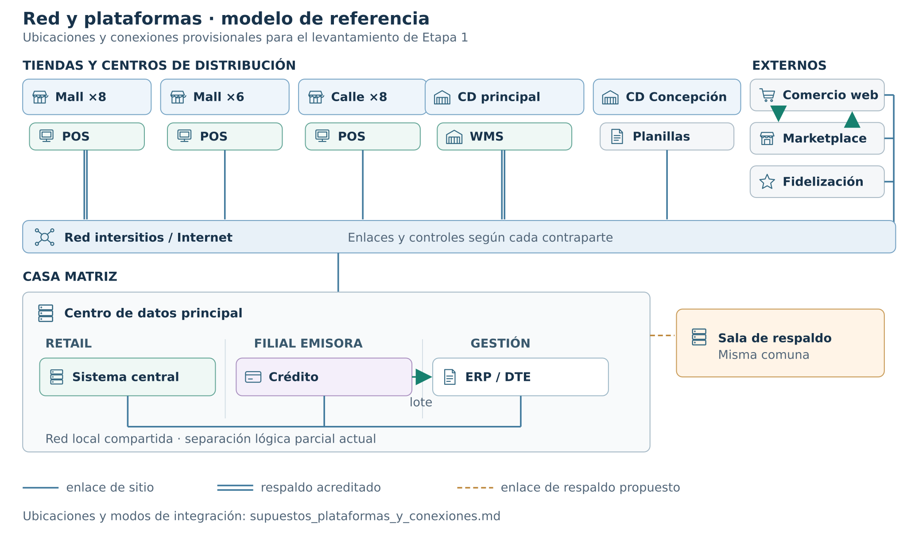

# Nota de lectura — red y plataformas, modelo físico provisional

**Propósito.** La figura ubica las plataformas existentes en un **modelo físico de referencia** para discutir conectividad y preparar el levantamiento. Combina sitios conocidos con ubicaciones supuestas; no es un inventario de cableado ni de las catorce interfaces técnicas. Los productos nuevos de la solución no aparecen.

**Hechos dibujados.** El Caso identifica 22 tiendas en 11 regiones: 14 en centros comerciales (ocho con respaldo propio y seis sin respaldo) y ocho a la calle, incluida Coyhaique sin respaldo. El centro de distribución principal dispone de dos enlaces de proveedores distintos y usa WMS; Concepción tiene un enlace y opera con planillas. Solo nueve tiendas separan las redes de cajas, administración, videovigilancia y clientes. Existe un centro de datos propio de 140 m² en casa matriz, compartido por Retail y la Filial emisora, y una sala de respaldo en la misma comuna. [Caso 09, capítulos 4–6](../../00_Bases/Caso_09_Cadena_Multitienda.md#L95) · [Conectividad y seguridad](../../00_Bases/Caso_09_Cadena_Multitienda.md#L325).

**Ubicaciones adoptadas.** El POS está en las tiendas y Concepción usa planillas, como dice el Caso. Para situar los demás componentes se supone que el WMS tiene servidor en el CD principal; sistema central Retail, crédito y ERP/DTE están en el centro de datos de casa matriz; comercio web, marketplace y fidelización se alojan externamente. Estas ubicaciones tienen confianza baja o media y no identifican fabricantes. La [matriz de supuestos](supuestos_plataformas_y_conexiones.md) registra el fundamento y la prueba pendiente de cada una.

**Cómo se conectan en el modelo.** POS, WMS, planillas y tres plataformas externas llegan por la red de sitios/acceso externo al centro de datos principal; dentro de él, sistema central, crédito y ERP/DTE comparten infraestructura de red con separación lógica parcial. Las líneas azules representan caminos físicos agregados, no una interfaz aplicativo-aplicativa por cada trazo. El doble enlace de Mall ×8 y del CD principal está acreditado en el Caso. La flecha verde de crédito a ERP/DTE representa el lote contable descrito por el Caso. Las dos flechas entre marketplace y comercio web son un **intercambio funcional supuesto** para publicar ofertas y conciliar pedidos; el contrato actual no está identificado. Los demás intercambios y modos, incluidos precio al POS, catálogo y existencia al comercio web y pedidos hacia tiendas/CD, están en la [tabla C-01–C-16](supuestos_plataformas_y_conexiones.md#3-tabla-de-conexiones-para-el-mapa-provisional). [Caso 09, anexo A](../../00_Bases/Caso_09_Cadena_Multitienda.md#L1005).

**Sala de respaldo.** Se propone conectarla directamente al **centro de datos principal**, no al edificio de casa matriz como una caja genérica: lo que se respaldaría son aplicaciones, datos y operación del centro. La línea ámbar representa ese enlace de réplica/recuperación **supuesto**, no un circuito existente acreditado. La sala está en la misma comuna, pero el Caso no entrega ruta, capacidad, distancia, tecnología, replicación ni RTO/RPO reales. Todo ello se valida antes de fijar el diseño de 4.2. [Caso 09, capítulo 6](../../00_Bases/Caso_09_Cadena_Multitienda.md#L325) · [Bases Transversales, sitio secundario](../../00_Bases/Bases_Transversales.md#L390).

**Límite de lectura.** La topología agregada conecta todos los componentes del modelo, pero **no afirma** que las catorce interfaces punto a punto usen ese mismo trayecto, que todo sistema esté conectado directamente al núcleo Retail ni que exista ya middleware. El proyecto debe verificar los contratos y sustituir las ubicaciones provisionales por las comprobadas. La [nota de ubicación documental](ubicacion_documental_supuestos_plataformas.md) indica cómo declarar estas hipótesis en SD-02, SD-03 y SD-04.
