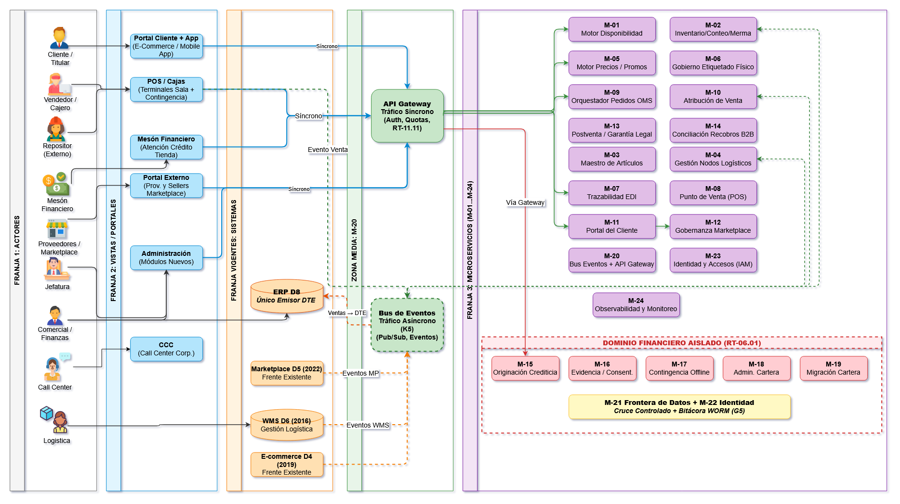

# Muestra visual de componentes

Este documento comprueba la jerarquía, los componentes informativos y el estilo corporativo de Only Simple Solutions.

::: callout-info
**Información:** componente de contexto con fondo turquesa claro y borde de marca.
:::

::: callout-alerta
**Alerta:** componente para una condición que requiere atención.
:::

::: resumen-ejecutivo
Síntesis destacada del contenido de la sección, con contraste y espaciado propios.
:::

::: kpi
**56 meses**
Cronograma contractual
:::

::: estado-completado
Estado de verificación: **Completado**
:::

| Dominio | Base declarada | Tratamiento |
|---|---:|---|
| Retail | 9 plataformas | Separación por dominio |
| Integración | 14 interfaces | Gobierno y trazabilidad |

## Prueba de imagen incrustada

La imagen se referencia desde Markdown y el generador la resuelve como recurso local, sin estilos inline.

